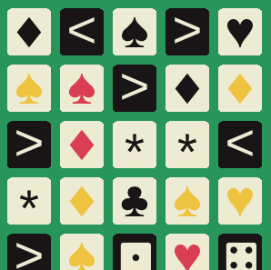

# ShufflePop

A simple mobile-style one-button game. You can play it [here.](https://andrew-maxwell.itch.io/shufflepop)

Made with [Raylib.](https://www.raylib.com/)

The font used everywhere (including for the suite symbols) is Cousine by Steve Matteson. I added the dice symbols myself, using FontForge.
